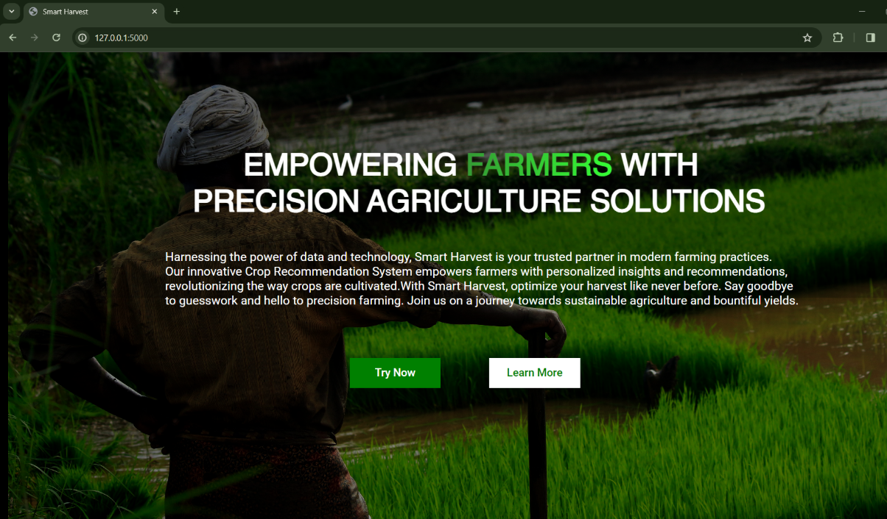
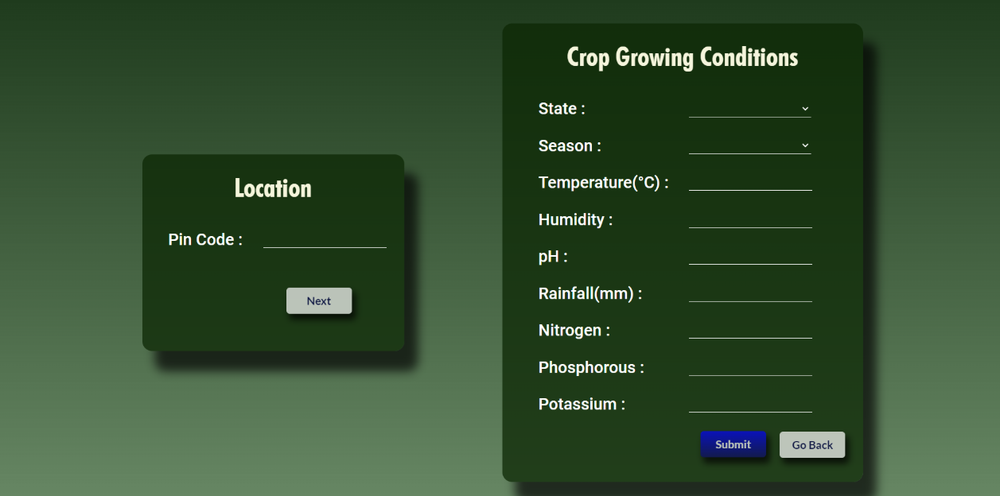
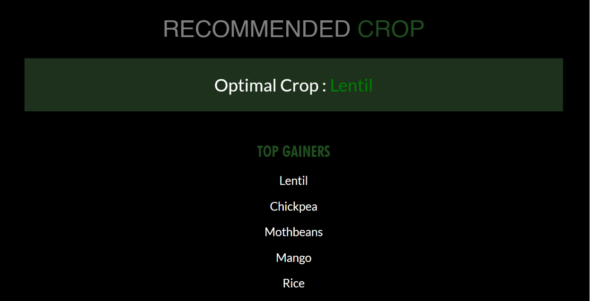
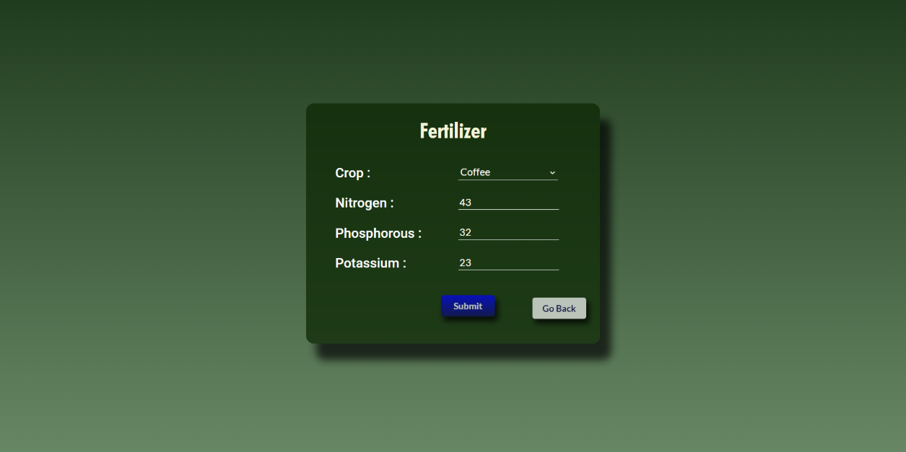
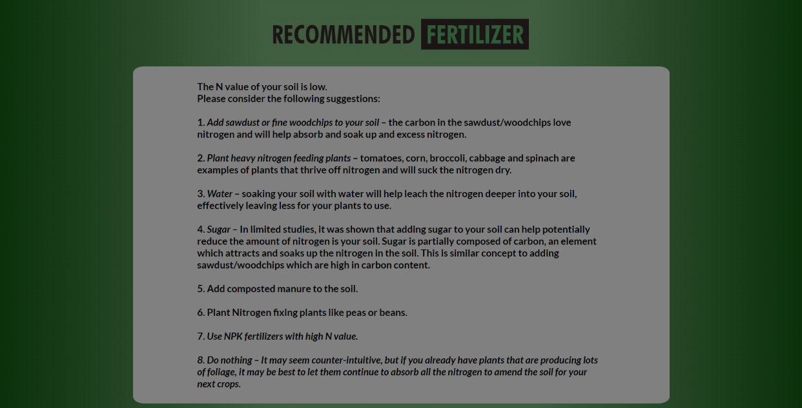
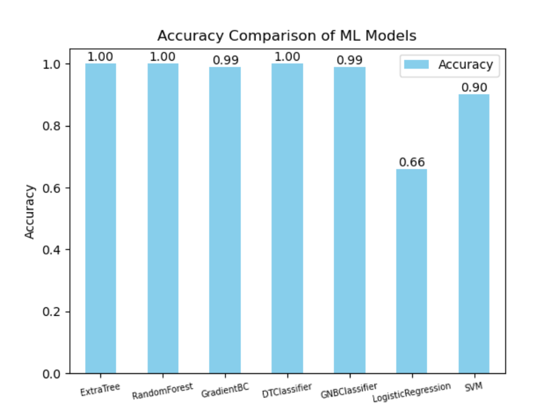
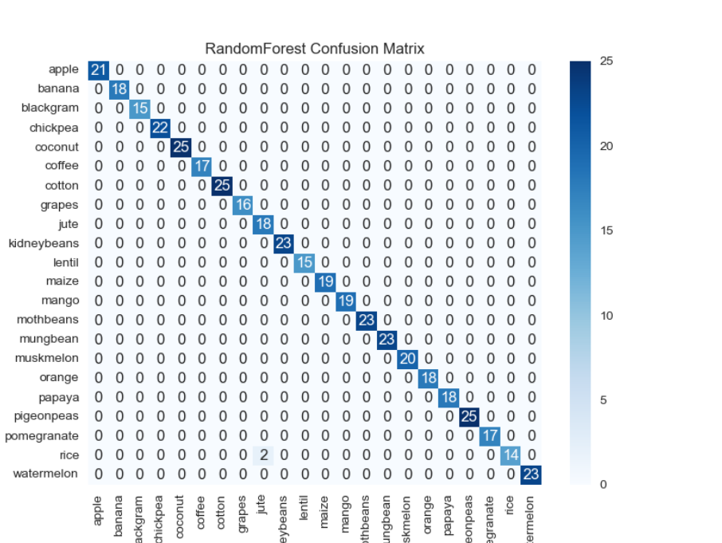

🌱 Smart Harvest – Crop & Fertilizer Recommendation System
📌 Overview

Smart Harvest is an AI-powered agriculture solution that recommends the most suitable crops and fertilizers based on soil and environmental conditions.

Built using Machine Learning models to improve agricultural decision-making
Provides crop recommendations + fertilizer suggestions in a single platform
Designed as an end-to-end application with real-time user input handling

🚀 Features
🌾 Crop recommendation based on soil nutrients and weather conditions
🧪 Fertilizer suggestion system using NPK values
📊 Multiple ML models for improved prediction accuracy
🌐 User-friendly interface for real-time inputs and results
📚 Detailed information about crops and cultivation practices

🛠 Tech Stack
Languages: Python, JavaScript
ML Algorithms: Random Forest, Decision Tree, SVM, Logistic Regression, ANN
Libraries: Pandas, NumPy, Scikit-learn
Framework: Flask
Frontend: HTML, CSS
Dataset: Crop Recommendation Dataset (Kaggle)

📂 Project Structure
├── app.py              # Main application (Flask app)
├── app.ipynb           # Model training & experimentation
├── dataset/            # Dataset files
├── static/             # CSS, JS files
├── templates/          # HTML templates
├── requirements.txt    # Dependencies
⚙️ How It Works
User inputs:
Soil nutrients (Nitrogen, Phosphorus, Potassium, pH)
Location / environmental details
System processes input using trained ML models

Outputs:
Top crop recommendations
Suitable fertilizer suggestions
▶️ Run Locally
1. Install dependencies
pip install -r requirements.txt
2. Run the application
python app.py

📊 Model Performance
Trained using multiple algorithms and compared for accuracy
Ensemble models like Random Forest performed best
Model selection based on accuracy and consistency

💡 My Contributions
Refactored and improved code structure for better readability
Enhanced UI flow and usability
Integrated multiple ML models for better prediction accuracy
Improved data handling and preprocessing pipeline

📌 Use Case
This system helps farmers and agricultural planners:
Choose the right crop for their soil
Optimize fertilizer usage
Improve yield and reduce resource wastage

🔒 Note
This project is inspired by open-source implementations and enhanced with additional features and improvements.

## 📸 Screenshots

